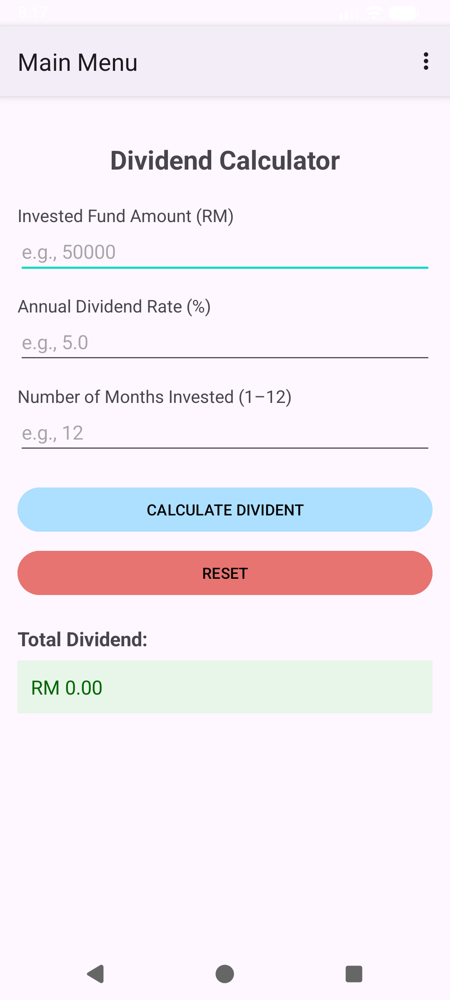

# Dividend Calculator

An Android app that calculates unit trust investment dividends.

## 📱 Features
- Input: Invested fund (RM), annual dividend rate (%), months (1–12)
- Accurate calculation:  
  'Monthly Dividend = (Rate / 12) × Invested Fund'  
  'Total Dividend = Monthly Dividend × Months'
- Clear & Calculate buttons
- Navigation menu (Home / About)
- About page with author info & GitHub link

## 🧪 Example Test Cases
| Input | Output |
|-------|--------|
| Fund: 50000, Rate: 5.0%, Months: 12 | **RM 2500.00** |
| Fund: 25000, Rate: 3.5%, Months: 6  | **RM 437.50** |
| Fund: 90000, Rate: 4.5%, Months: 9  | **RM 3037.50** |

## 📸 Screenshots

## 🛠️ Built With
- Android Studio
- Java
- XML

## 🧑‍🎓 Author
- **Name**: [ WAN MUHAMMAD FAWAZ ISYRAF BIN ZAIMI ]  
- **Matric No**: [ 2023258546 ]  
- **Course ICT602**: Mobile Technology and Development  

© 2025. All rights reserved.
